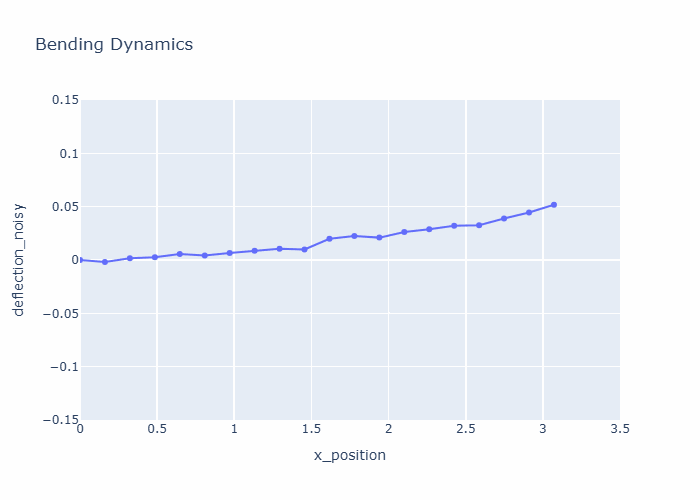

# Aircraft Wing Spar: Structural Health Monitoring
> **Data-Driven Analysis of Beam Deflection and Elastic Limits**

## Dynamic Structural Simulations
These animations visualize the wing spar's behavior under aerodynamic stress.

| **Animation A: Load vs. Deflection** | **Animation B: Spatial Bending Profile** |
| :---: | :---: |
|  |  |
| *Linear elastic response at Node 19.* | *The physical S-curve of the entire 3.07m spar.* |

## Project Overview
This repository contains a computational pipeline for monitoring the structural health of an aircraft wing spar. By processing telemetry from **Node 19** and mapping the **Spatial Bending Profile** across 20 nodes, the system validates the proportional relationship between aerodynamic load factors (G) and structural deflection (m).

## Key Features
* **Dual-Mode Animation:** Visualizes both point-specific stress and full-spar geometric deformation.
* **Automated Data Cleaning:** Handles missing sensor packets and isolates specific node telemetry.
* **Statistical Validation:** Verified a Pearson Correlation Coefficient (r) of **0.9998**.
* **Digital Twin Readiness:** Uses a decimated spatial sampling strategy to provide real-time structural feedback.

---

## Tech Stack

---

## Live Interactive Models
Access the high-fidelity interactive digital twins here:  
* [🚀 View Tip Deflection Animation](https://kurtamn70-png.github.io/EDS_TUPM-25-0593_Amandy/outputs/animation_structural_response.html)
* [🚀 View Full Spatial Bending Animation](https://kurtamn70-png.github.io/EDS_TUPM-25-0593_Amandy/outputs/animation_spatial_bending.html)

---

**Student:** Kurt Andrew Amandy  
**Student ID:** TUPM-25-0593  
**Institution:** Technological University of the Philippines - Manila